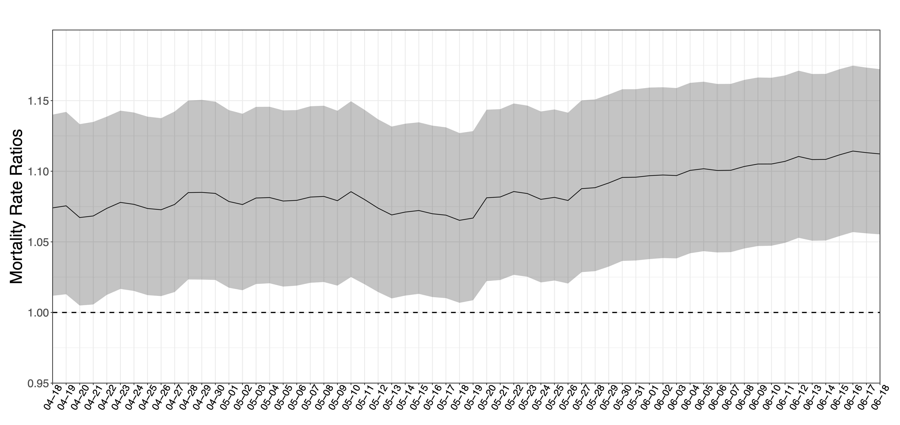

# Air pollution and COVID-19 mortality in the United States

This is the data repository for public available code and data to reproduce analyses in Wu, X., Nethery, R. C., Sabath, M. B., Braun, D. and Dominici, F., 2020. Air pollution and COVID-19 mortality in the United States: Strengths and limitations of an ecological regression analysis. Science advances, 6(45), p.eabd4049. 

<b>For more updated county-level PM2.5 and US Census Data, please download from https://github.com/wxwx1993/PM_COVID/tree/updated_data.</b> 

<b>Summary Results: </b> 

Figure: COVID-19 mortality rate ratios (MRR) per 1 μg/m3 increase in PM2.5 and 95% CI using daily cumulative COVID-19 death counts from April 18, 2020 to June 18, 2020.

<b>Code: </b> 
[`Prepossing.R`](https://github.com/wxwx1993/PM_COVID/blob/master/Preprocessing.R) includes the code to extract all necessary data and prepocess data for statistical analyses.

[`Analyses.R`](https://github.com/wxwx1993/PM_COVID/blob/master/Analyses.R) includes the code to implement negative binomial mixed models in primary, secondary and sensitivity analyses.

[`Figure.R`](https://github.com/wxwx1993/PM_COVID/blob/master/Figure.R) includes the code to generate figures in Main Text and Supplementary Materials.

[`additional_preprocessing_code`](https://github.com/wxwx1993/PM_COVID/tree/master/additional_preprocessing_code) contains markdown files with code demonstrating the methodology we used to aggregate our zip code level data to the county level.

<b>Data: </b> 
county_pm25.csv: the county-level PM2.5 exposure data averaged across the period 2000-2016, averaged across grid cells within a zip code and then averaging across zip codes within a county. For more source information see Additional Data Source section.

temp_seasonal_county.csv: the county-level seasonal temperature and relative humidity data, summer and winter averaged across the period 2000-2016 and averaged across grid cells in each county. For more source information see Additional Data Source section.

census_county_interpolated.csv: the county-level socioeconomic and demographic variables from 2012-2016 American Community Survey, extracted for each zip code and then averaging across zip codes within a county. For more source information see Additional Data Source section.

county_base_mortality.txt, county_old_mortality.txt: additional county-level socioeconomic and demographic variables from 2009-2016 
US CDC Compressed Mortality Data (https://wonder.cdc.gov/cmf-ICD10.html).

brfss_county_interpolated.csv: the county-level behavioral risk factor variables for 2011 US CDC Behavioral Risk Factor Surveillance System (https://www.cdc.gov/brfss/). (deprecated from the updated analyese due to servere missningness). In the final analysis, we use county-level health risk factors: proportion of residents obese and proportion of residents that are current smokers from the Robert Wood Johnson Foundation’s 2020 County Health Rankings.

statecode.csv: A map between state name and state abbreviations.

<b>Additional Data Source: </b> 
The county-level PM2.5 exposure data can be created via PM2.5 predictions from The Atmospheric Composition Analysis Group at Dalhousie University (http://fizz.phys.dal.ca/~atmos/martin/). Please visit the detailed instructions below

- Download PM25 predictions: https://github.com/wxwx1993/PM_COVID/blob/master/additional_preprocessing_code/download_pm25_values.md. This code makes use of ZIP code shape files provided by ESRI.
- County-level aggregation: https://github.com/wxwx1993/PM_COVID/blob/master/additional_preprocessing_code/rm_pm25_to_county.md

We thank Randall Martin and the members of the Atmospheric Composition Analysis Group at Dalhousie University for providing access to their open-source datasets. Their data (V4.NA.02.MAPLE) that we used can be found here: https://sites.wustl.edu/acag/datasets/surface-pm2-5/. Citation: van Donkelaar, A., R. V. Martin, C. Li, R. T. Burnett, Regional Estimates of Chemical Composition of Fine Particulate Matter using a Combined Geoscience-Statistical Method with Information from Satellites, Models, and Monitors, Environ. Sci. Technol., doi: 10.1021/acs.est.8b06392, 2019. 

The seasonal temperature and relative humidity data can be created via 4km × 4km temperature and relative humidity predictions from Gridmet via google earth engine (https://developers.google.com/earth-engine/datasets/catalog/IDAHO_EPSCOR_GRIDMET).

We thank John Abatzoglou and members of the Climatology Lab at University of Idaho for providing the GRIDMET open-source datasets. 

The county-level socioeconomic and demographic variables from 2012-2016 American Community Survey can be created from US Census website

- Download zip code-level SES variables from ACS for each zip code: https://www.census.gov/programs-surveys/acs/data.html
- County-level aggregation: https://github.com/wxwx1993/PM_COVID/blob/master/additional_preprocessing_code/census_to_county.md

Additional data required by the analyses can be directly extracted from data sources:

* Johns Hopkins University the Center for Systems Science and Engineering (CSSE) Coronavirus Resource Center: https://coronavirus.jhu.edu/  
* Homeland Infrastructure Foundation-Level Data (HIFLD): https://hifld-geoplatform.opendata.arcgis.com/datasets/hospitals  
* Robert Wood Johnson Foundation County Health Rankings: https://www.countyhealthrankings.org/  
* The COVID tracking project: https://covidtracking.com/  
* Carnegie Mellon University COVIDcast Delphi Research Group: https://covidcast.cmu.edu/  
* Facebook Data for Good project: https://www.facebook.com/geoinsights-portal/  

We thank all of them for making their data public and for enabling this research to be possible.

<b>Contact Us: </b> 
* Email: fdominic@hsph.harvard.edu

<b>Terms of Use:</b> 
Authors/funders retain copyright (where applicable) of code on this Github repo and the article in press on Science Advances (A pre-print version posted on medRxiv). Anyone who wishes to share, reuse, remix, or adapt this material must obtain permission from the corresponding author. By using the contents on this Github repo and the article, you agree to cite:

1. Wu, X., Nethery, R. C., Sabath, M. B., Braun, D. and Dominici, F., 2020. Air pollution and COVID-19 mortality in the United States: Strengths and limitations of an ecological regression analysis. Science advances, 6(45), p.eabd4049.

2. A pre-print version can be found at: Exposure to air pollution and COVID-19 mortality in the United States. Xiao Wu, Rachel C. Nethery, Benjamin M. Sabath, Danielle Braun, Francesca Dominici. medRxiv 2020.04.05.20054502; doi: https://doi.org/10.1101/2020.04.05.20054502

This GitHub repo and its contents herein, including data, link to data source, and analysis code that are intended solely for reproducing the results in the manuscript "Air pollution and COVID-19 mortality in the United States: strengths and limitations of an ecological regression analysis." The analyses rely upon publicly available data from multiple sources, that are often updated without advance notice. We hereby disclaim any and all representations and warranties with respect to the site, including accuracy, fitness for use, and merchantability. By using this site, its content, information, and software you agree to assume all risks associated with your use or transfer of information and/or software. You agree to hold the authors harmless from any claims relating to the use of this site.
